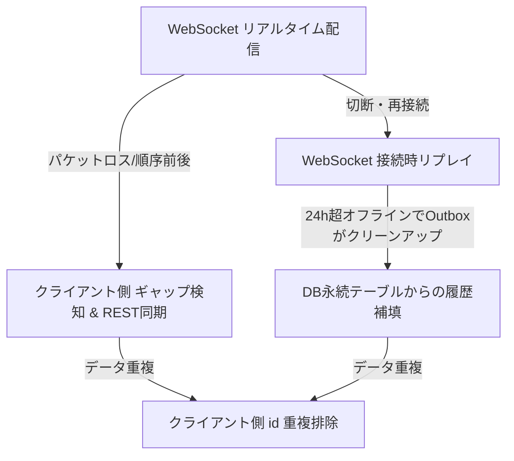
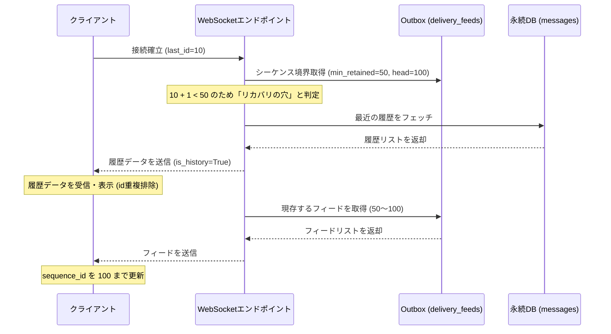

# データ受信と復旧（リカバリ）アーキテクチャ設計書

本ドキュメントでは、WebSocket 接続を通じたメッセージ受信の仕組み、接続切断時の自動再接続、データロストを防ぐためのリプレイおよびギャップ同期、そして長期間のオフラインに伴う「リカバリの穴」が発生した際のデータベースからの履歴フォールバック（自動回復）設計について記述します。

---

## 1. 全体像（データ受信と信頼性保証）

本システムでは、メッセージや通知の取りこぼし（データロスト）を防ぎ、一時的な切断から復帰した際にも最新状態へ自動同期するために、**「At-Least-Once（最低1回）配信 + クライアント側での重複排除」**の原則に基づいて設計されています。

データ受信と整合性維持は、以下の4つの層によって実現されています。



---

## 2. WebSocket 接続とイベント購読

### 2.1 接続維持と死活監視 (`useConnection.ts`)
*   **チケット制認証**: WebSocket 接続を開始する前に、クライアントは BFF / API サーバーからワンタイムチケットを取得（`/api/auth/ws-ticket`）し、クエリパラメータとして渡してセキュアに接続します。
*   **PING/PONG による死活監視**: 接続確立後、サーバーとクライアント間で定期的な死活監視を行います。一定時間応答（PONG）がない場合は、自動的にソケットをクローズし、再接続フェーズへ移行します。
*   **指数バックオフ再接続**: 予期せぬ切断時には、初期値 1,000ms から最大 30,000ms まで指数関数的に待機時間を延ばしながら自動再接続を試みます。
*   **アンマウント時のリーク防止**: React の `StrictMode`（二重マウント）やログアウト、ページ遷移などによるアンマウント時に、非同期処理の途中で orphan socket（制御不能な浮きソケット）が残るのを防ぐため、`isMountedRef` によるライフサイクル管理を行い、切断時には確実にソケットをクローズします。

### 2.2 安全なイベント購読 (`useWsSubscribe.ts`)
*   **参照の安定化**: クライアントは受信したいイベントタイプ（`global_chat` や `presence_state` など）ごとにハンドラを登録します。
*   **購読チャーンの防止**: 登録されたハンドラは `useRef` を介して呼び出されます。ハンドラの参照が変わっても WebSocket の購読解除・再登録が発生しないため、**購読張り替え中の一瞬の隙にメッセージが届いて取りこぼすリスク**が完全に排除されています。

---

## 3. 受信データの重複排除 (Idempotency)

At-Least-Once 配信や再接続時のリプレイ、REST API による重複取得が発生した際、UI の表示崩れやデータの二重追加を防ぐために、クライアント側（Hooks 側）で**ID による重複排除**を行います。

*   **一意なエンティティ ID**: 送信されるすべてのデータ（チャットメッセージ、ダイレクトリクエスト）は、DB 上のプライマリキー（`id`）を持ちます。
*   **マージ処理 (`mergeById`)**: 新しいデータを受信した際、既存のリストに同じ `id` のエンティティが存在する場合は更新（上書き）し、存在しない場合のみ新規追加します。これにより、同じメッセージが複数回届いても安全に収束します。

---

## 4. 再接続時のデータ復旧（リカバリ）

クライアントが一時的にオフラインになった後、再接続した際のデータ復旧は「WebSocket でのリプレイ」と「REST によるギャップ同期」の二重の網で保護されています。

### 4.1 WebSocket 接続時のフィードリプレイ
再接続時、クライアントはクエリパラメータとして自身が最後に受信した ID (`last_chat_id`, `last_request_id`) をサーバーに送信します。

1.  **サーバー側の判定**: サーバーは指定された `last_id` を起点に、Outbox データベース (`delivery_feeds`) からその後の未配信フィードを `limit=500` 件まで取得します。
2.  **リプレイ送信**: 取得したフィードを、新しく確立された WebSocket 接続を通じて即座にクライアントにリプレイ送信します。

### 4.2 稼働中のギャップ検知と REST 同期 (`feedSyncRunner.ts`)
WebSocket 経由で受信したメッセージの `sequence_id` が、クライアントが持っている `last_sequence_id + 1` よりも大きい場合（飛び番）、その間のメッセージを取りこぼしている（ギャップがある）と判定します。

```text
クライアントの last_id: 10
受信したメッセージの sequence_id: 12  ->  [11] が欠落（ギャップ検知！）
```

ギャップを検知した場合、クライアントは REST API を用いて自動同期を開始します。
*   **REST 取得**: `/api/feeds/global_chat?after_chat_id=...` または `/api/feeds/direct_requests?after_request_id=...` を呼び出して、欠落したフィードを補填します。
*   **同期中の保留ループ (Pending Queue)**: 同期処理を実行している最中にさらに新しいギャップが検知された場合、その要求を破棄せず `pendingSyncRef` に保留し、現在の同期完了後に再度最新のカーソルから自動的に再同期を行います。
*   **バックオフ付きリトライ**: ネットワーク障害等で REST 同期が一時的に失敗した場合、指数バックオフで自動リトライ（最大 5 回）を行い、途中で諦めて穴が残るのを防ぎます。
*   **ページング処理**: サーバー側の負荷軽減のため、1 回の REST リクエストで返される件数には上限（500件）がありますが、クライアントは空のレスポンスになるまでカーソルを進めて繰り返し取得し、全件を漏れなく同期します。

---

## 5. 長期オフラインと「リカバリの穴」へのフォールバック

### 5.1 クリーンアップとリカバリの限界
サーバー側では、配信が完了した古い Outbox レコードを定期的に削除するクリーンアップワーカー（`cleanup_worker.py`）が稼働しています（デフォルト 24 時間）。
そのため、クライアントが **24 時間以上オフライン**だった場合、クライアントの `last_id` 直後のフィードが Outbox から消失し、Outbox 経由の差分復旧が不可能になります（これを**「リカバリの穴（Hole）」**と呼びます）。

### 5.2 穴の検知ロジック (`endpoint.py` の `has_recovery_hole`)
サーバーは WebSocket 接続の初期化時に、以下の条件から「リカバリの穴」が発生しているかを判定します。

*   **パラメータ**:
    *   `last_id`: クライアントから送られてきた最後の受信 sequence_id
    *   `min_retained`: Outbox テーブルに現存する最小の sequence_id
    *   `head`: 採番済みの最大の sequence_id
*   **判定**:
    *   `head` が存在し、`head > last_id`（未受信のデータがある）
    *   かつ、`min_retained is None`（現存データなし）または `min_retained > last_id + 1`（現存データの最小値が、クライアントが要求する次のIDよりも大きい）

上記条件を満たす場合、すでに必要な差分フィードが Outbox から削除されているため、**「穴あり」**と判定されます。

### 5.3 データベースからの履歴補填フロー
「リカバリの穴」が検知された場合、サーバーは Outbox 差分での復旧を諦め、**再生データベース（`messages` や `tasks` テーブル）から直近の履歴（スナップショット）を取得してクライアントに送る**というフォールバック処理を行います。



1.  **履歴の補填**: サーバーは履歴フェッチャー（`global_chat_service.get_recent_messages` など）を実行し、メッセージを `is_history=True` としてクライアントに一括送信します。
    *   ※ 履歴データには `sequence_id` が含まれないため、クライアントの `last_sequence_id` は更新されません。
2.  **現存フィードの送信**: 履歴送信後、Outbox に現存しているフィード（`min_retained` から `head` まで）を通常通りクライアントに送信します。
3.  **クライアント側でのマージ**: クライアントは履歴データと現存フィードの両方を受信します。履歴とフィードでデータが重複しますが、**エンティティ ID による重複排除 (`mergeById`)** によって UI には二重表示されず、最終的に最新の `sequence_id`（`head`）まで安全に更新されます。

---

## 6. シーケンスの独立設計

メッセージの順序性と欠番のない連番を維持するために、ストリームごとに独立したシーケンス名で管理されています。

*   **グローバルチャット (`global_chat`)**:
    *   システム全体で単一の連番を持ちます。
*   **ダイレクトリクエスト (`direct_request:{username}`)**:
    *   ユーザーごとの DM 受信インボックスごとに独立した連番を持ちます。
    *   自分の関係する（自分が送信した、または自分宛ての）DM だけがこのシーケンスに記録されるため、他のユーザー同士の DM 送信によってシーケンス番号が進んでしまうことがありません。
