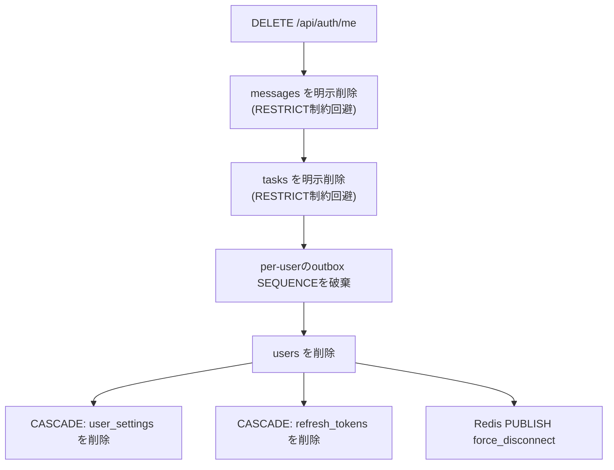

# ユーザー / ユーザー設定 (User & User Settings)

本ドキュメントは、ユーザー本体のプロファイル管理（表示名変更、パスワード変更、アカウント削除、パスワードリセット）と、ユーザーごとの通知設定の永続化、およびアクティブセッション一覧・個別失効の設計と実装をまとめたものです。ログイン・JWTセッション発行・WebSocketチケット認証そのものについては [認証・認可 設計仕様](/okf/docs/auth.md) を参照してください。

---

## 1. オニオンアーキテクチャの各レイヤーにおける実装

### 🔑 ドメイン層 (Domain Layer)

- [user.py (User エンティティ)](/backend/app/domain/entities/user.py)
  - `id` (UserId/UUIDv7), `userid` (不変ログインID), `username` (可変表示名), `hashed_password` を保持する frozen dataclass。
- [user_settings.py (UserSettings エンティティ)](/backend/app/domain/entities/user_settings.py)
  - `user_id`, `global_chat`, `direct_request`, `direct_request_updated`, `browser_notification` の通知設定値を保持。
- [primitives.py (値オブジェクト)](/backend/app/domain/primitives/primitives.py)
  - `Userid`: 1〜50文字・`^[a-zA-Z0-9_-]+$` のみ許可（ログインID）。
  - `Username`: 1〜50文字（表示名、非ASCII可）。
  - `Password`: 4文字以上（平文）。
  - `HashedPassword`: bcrypt 形式（`$2a$`/`$2b$`/`$2y$` 接頭辞）であることを検証。
- [user_repository.py (UserRepository)](/backend/app/domain/repositories/user_repository.py)
  - `get_by_id` / `get_by_userid` / `save` / `delete` / `update_username`（messages・tasks 等の非正規化コピーの一括更新）の抽象プロトコル。
- [user_settings_repository.py (UserSettingsRepository)](/backend/app/domain/repositories/user_settings_repository.py)
  - `get` / `upsert` の抽象プロトコル。

### 🔑 アプリケーション層 (Application Layer)

- [auth_service.py (認証・アカウントサービス)](/backend/app/application/services/auth_service.py)
  - `update_username(user_id, new_username)`: messages/tasks の非正規化コピーを一括更新後、`username` を更新し `reconnect` イベントを発行（強制切断はしない）。
  - `change_password(user_id, current_password, new_password)`: 現在のパスワードを bcrypt 照合のうえ新パスワードへ更新し、当該ユーザーの `refresh_tokens` を全削除（全セッション無効化）して `force_disconnect` イベントを発行。
  - `delete_account(user_id)`: 関連する `messages` / `tasks` を明示削除し、ユーザー専用 outbox SEQUENCE を破棄したうえでユーザー本体を削除（`user_settings` / `refresh_tokens` は CASCADE）し、`force_disconnect` イベントを発行。
  - `forgot_password(userid)` / `reset_password(token, new_password)`: Redis にワンタイムトークン（TTL 15分、キー `password_reset:<token>`）を保存するパスワードリセットフロー。ユーザー列挙対策として、未登録ユーザーでもエラーを返さない。リセット成功時も全セッションを無効化し `force_disconnect` を発行。
  - `get_active_sessions(user_id)` / `revoke_session(user_id, token_id)`: アクティブセッション一覧取得と個別セッション失効。
- [user_settings_service.py (UserSettingsService)](/backend/app/application/services/user_settings_service.py)
  - `get_settings(user_id)`: 未登録時はデフォルト値（`global_chat`/`direct_request`/`direct_request_updated`=True, `browser_notification`=False）を返却。
  - `update_settings(...)`: リポジトリへ upsert。

### 🔑 インフラストラクチャ層 (Infrastructure Layer)

- [sa_user_repository.py (SQLAlchemy)](/backend/app/infrastructure/persistence/sa_user_repository.py)
  - `users` テーブルへの永続化、および `update_username` による `messages.username` / `tasks.sender` / `tasks.recipient` の一括更新。
- [sa_user_settings_repository.py (SQLAlchemy)](/backend/app/infrastructure/persistence/sa_user_settings_repository.py)
  - PostgreSQL の `INSERT ... ON CONFLICT DO UPDATE` による upsert 実装。
- [orm_models.py (ORM定義)](/backend/app/infrastructure/persistence/orm_models.py)
  - `UserORM`（`users`, `userid` 一意制約）, `UserSettingsORM`（`user_settings`, `user_id` を PK かつ `users.id` への `ON DELETE CASCADE` FK）, `RefreshTokenORM`（`refresh_tokens`, `users.id` への `ON DELETE CASCADE` FK）。
- [views.py (SQLAdmin)](/backend/app/presentation/admin/views.py)
  - `UserAdmin`: `hashed_password` を一覧・詳細・編集フォームから除外。`username` も `form_excluded_columns` で編集禁止（変更には messages/tasks の非正規化更新と WebSocket 再接続パブリッシュを伴うため、正規ユースケース `PATCH /api/auth/me` 経由に限定）。
  - `UserSettingsAdmin`: 通知設定の閲覧用ビュー。
  - `RefreshTokenAdmin`: `token_hash` を除外。管理画面から削除した場合も `after_model_delete` フックで `force_disconnect` イベントを Redis に発行する。

### 🔑 プレゼンテーション層 (Presentation Layer)

- [auth.py (FastAPI ルーター)](/backend/app/presentation/api/auth.py)
  - ユーザー/アカウント関連: `GET /me`, `PATCH /me`（表示名変更）, `DELETE /me`（退会）, `POST /change-password`, `POST /forgot-password`, `POST /reset-password`, `GET /sessions`, `DELETE /sessions/{session_id}`, `GET /users`（チャット相手選択用の一覧）。
  - DTO: `MeResponse`, `UpdateUsernameRequest`, `ChangePasswordRequest`, `ActiveSessionResponse`, `UserListResponse`。
- [user_settings.py (FastAPI ルーター)](/backend/app/presentation/api/user_settings.py)
  - `GET /api/user_settings`, `PUT /api/user_settings`。DTO: `UserSettingsResponse`, `UpdateUserSettingsRequest`。
- [api.ts (フロントエンドAPIクライアント)](/frontend/src/features/auth/api.ts)
  - `updateUsername`, `changePassword`, `unregisterUser`, `forgotPassword`, `resetPassword`, `fetchActiveSessions`, `revokeSession`。
- [useAccountSettings.ts (アカウント設定フック)](/frontend/src/features/auth/hooks/useAccountSettings.ts)
  - 表示名変更・パスワード変更・退会の各ハンドラと、`WorkspaceContext` への状態反映。
- [useSessions.ts (セッション管理フック)](/frontend/src/features/auth/hooks/useSessions.ts)
  - アクティブセッション一覧の取得・ソート（`is_current` を先頭に、以降は作成日時降順）、個別失効。
- [useNotificationSettings.ts (通知設定フック)](/frontend/src/features/common/notifications/useNotificationSettings.ts)
  - サーバー設定の初期取得とオプティミスティック更新（失敗時ロールバック）。
- [notificationSettings.ts (クライアント側ストア)](/frontend/src/lib/notificationSettings.ts)
  - `subscribe`/`updateSetting` による軽量な購読ストア。初期化完了前にユーザーが操作したキーは `modifiedKeys` で保護し、サーバー設定の到着で上書きされないようにする。
  - 画面: `/frontend/src/app/(authenticated)/settings/page.tsx`（通知設定 + アカウント設定の入口）, `settings/username/page.tsx`, `settings/password/page.tsx`, `settings/delete/page.tsx`（いずれも同ディレクトリ配下）。
  - コンポーネント: [NotificationSettings.tsx](/frontend/src/features/workspace/components/NotificationSettings/NotificationSettings.tsx), [ChangeUsernameForm.tsx](/frontend/src/features/workspace/components/NotificationSettings/ChangeUsernameForm.tsx), [ChangePasswordForm.tsx](/frontend/src/features/workspace/components/NotificationSettings/ChangePasswordForm.tsx), [DeleteAccountForm.tsx](/frontend/src/features/workspace/components/NotificationSettings/DeleteAccountForm.tsx), [SessionList.tsx](/frontend/src/features/workspace/components/SessionList/SessionList.tsx)。

---

## 2. データの流れと設計 (Data Flow & Architecture)

### 2.1 表示名変更（再接続のみ、セッションは維持）

```mermaid
sequenceDiagram
    autonumber
    actor Browser as ブラウザ
    participant BFF as BFF (Next.js)
    participant API as バックエンド (FastAPI)
    database DB as PostgreSQL
    participant Redis as Redis Pub/Sub

    Browser->>BFF: PATCH /api/proxy/auth/me { username }
    BFF->>API: PATCH /api/auth/me (Authorization: Bearer)
    API->>DB: messages.username / tasks.sender,recipient を一括更新
    API->>DB: users.username を更新
    API->>Redis: PUBLISH session_control { type: "reconnect", user_id }
    API-->>BFF: MeResponse { id, userid, username }
    BFF-->>Browser: 更新後ユーザー情報
    Note over Browser: WorkspaceContext を更新し、各タブの WebSocket に再接続を促す<br/>（force_disconnectとは異なりログアウトはしない）
```

### 2.2 パスワード変更・パスワードリセット（全セッション無効化）

```mermaid
sequenceDiagram
    autonumber
    actor Browser as ブラウザ
    participant BFF as BFF (Next.js)
    participant API as バックエンド (FastAPI)
    database DB as PostgreSQL
    participant Redis as Redis Pub/Sub

    Browser->>BFF: POST /api/proxy/auth/change-password
    BFF->>API: POST /api/auth/change-password
    Note over API: bcryptで現在パスワードを照合
    API->>DB: hashed_password を更新
    API->>DB: DELETE FROM refresh_tokens WHERE user_id = ?
    API->>Redis: PUBLISH session_control { type: "force_disconnect", user_id }
    API-->>BFF: { success: true }
    BFF-->>Browser: 200 OK
    Note over Browser: 「他のセッションは切断されました」と表示し、自身もログアウト処理を実行
```

`forgot_password` / `reset_password` も同様に、Redis に保存したワンタイムトークン（TTL 15分）を検証して新パスワードを設定し、最後に `refresh_tokens` を全削除して `force_disconnect` を発行する。

### 2.3 アカウント削除（カスケード削除）



フロントエンドでは [DeleteAccountForm.tsx](/frontend/src/features/workspace/components/NotificationSettings/DeleteAccountForm.tsx) で `window.confirm` による確認後、`unregisterUser()` が直接 [unregister/route.ts](/frontend/src/app/api/auth/unregister/route.ts) を呼び出し、Cookie 削除後 `/` へリダイレクトする（`change-password`/`username` のような `/api/proxy/...` 経由のBFFプロキシではなく専用のルートハンドラを使用）。

### 2.4 通知設定（サーバー永続化 + オプティミスティック更新）

```mermaid
sequenceDiagram
    autonumber
    actor Browser as ブラウザ
    participant BFF as BFF (Next.js)
    participant API as バックエンド (FastAPI)
    database DB as PostgreSQL

    Browser->>BFF: GET /api/proxy/user_settings (初回マウント)
    BFF->>API: GET /api/user_settings
    API->>DB: SELECT user_settings WHERE user_id = ? (無ければデフォルト値)
    API-->>BFF: UserSettingsResponse
    BFF-->>Browser: 通知設定を初期化 (initSettings)
    Browser->>Browser: トグル操作 → ローカル即時反映 (updateSetting)
    Browser->>BFF: PUT /api/proxy/user_settings
    BFF->>API: PUT /api/user_settings
    API->>DB: INSERT ... ON CONFLICT DO UPDATE
    alt 保存失敗
        API-->>BFF: エラー
        BFF-->>Browser: エラー
        Browser->>Browser: ロールバック + トースト表示
    end
```

`global_chat` / `direct_request` / `direct_request_updated` のデフォルトは `true`、`browser_notification` は `false`。`browser_notification` を ON にする操作はブラウザの通知許可ダイアログ（[browserNotification.ts](/frontend/src/lib/browserNotification.ts)）と連動しており、許可が得られない場合はサーバーへの保存自体を行わない。

### 2.5 アクティブセッション一覧・個別失効

`GET /api/auth/sessions` で取得した一覧は `is_current` を先頭に、以降は作成日時の降順でソートされる（[useSessions.ts](/frontend/src/features/auth/hooks/useSessions.ts)）。個別の `DELETE /api/auth/sessions/{session_id}` は対象セッションのみを `force_disconnect_session` で切断し、他デバイスには影響しない（詳細は [認証・認可 設計仕様 §3.4](/okf/docs/auth.md)）。

---

## 3. 信頼性・セキュリティ・制限ルール (Reliability & Resiliency)

1. **バリデーション制約**:
   - `Userid`（ログインID）: 1〜50文字、英数字・アンダースコア・ハイフンのみ（不変）。
   - `Username`（表示名）: 1〜50文字、空文字不可（可変・非ASCII許可）。
   - `Password`: 平文4文字以上。`HashedPassword` は bcrypt 形式（`$2a$`/`$2b$`/`$2y$`）であることをドメイン層で強制。
2. **全セッション無効化が必須な操作**: パスワード変更・パスワードリセット・アカウント削除は、不正利用された認証情報や端末からの継続アクセスを遮断するため、必ず当該ユーザーの `refresh_tokens` を全削除し `force_disconnect`（`session_id` を伴わない）を発行する。表示名変更は認証情報に影響しないため `reconnect` のみで全セッション維持。
3. **アカウント削除時の整合性**: `messages` / `tasks` は外部キーの `RESTRICT` 制約を回避するため、削除前に明示的な一括削除を行う。`user_settings` / `refresh_tokens` は `ON DELETE CASCADE` で自動削除される。ダイレクトリクエスト用の per-user outbox SEQUENCE も明示的に破棄し、カタログ肥大化を防止する。
4. **パスワードリセットトークン**: Redis に `password_reset:<token>` キーで TTL 15分保存。ユーザー列挙脆弱性対策として、存在しない `userid` を指定した `forgot_password` でもエラーを返さず常に成功扱いとする。
5. **SQLAdminによる防護**: `hashed_password` は SQLAdmin の一覧・詳細・編集フォームから完全に除外。`username` も編集フォームから除外し、非正規化コピー更新やWebSocket再接続パブリッシュを伴う正規のユースケース（`PATCH /api/auth/me`）以外からの変更を禁止する。`RefreshTokenORM` を管理画面から削除した場合も整合性のため `force_disconnect` イベントを発行する。
6. **通知設定の楽観的更新**: フロントエンドはトグル操作を即時にローカル状態へ反映し、バックエンドへの保存が失敗した場合のみ直前の値へロールバックしてトースト通知を表示する。初期化完了前（サーバー設定取得中）にユーザーが操作したキーは `modifiedKeys` で保護され、後から到着するサーバー値で上書きされない。
