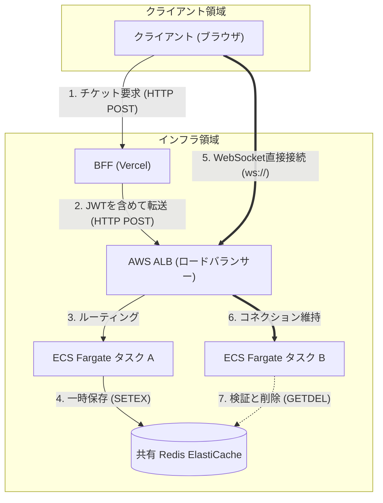
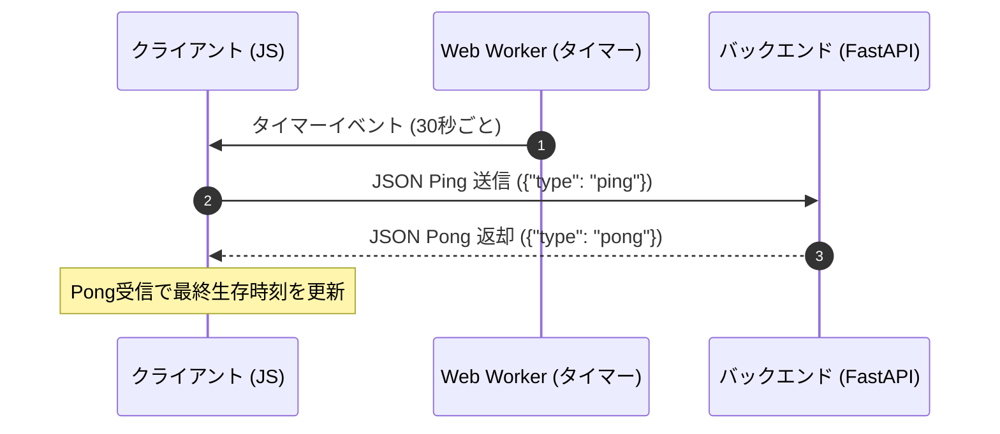

# WebSocket リアルタイム通信 (WebSocket Realtime Communication)

本ドキュメントは、システムにおけるリアルタイム通信のための WebSocket 接続管理、ハートビート（Ping/Pong）、自動再接続、ワンタイムチケット認証、および Redis Pub/Sub を用いたマルチインスタンス（スケールアウト対応）配信設計についてまとめたものです。

---

## 1. オニオンアーキテクチャの各レイヤーにおける実装

### 📡 ドメイン層 (Domain Layer)
接続管理やプレゼンス状態に関わるドメインの抽象概念。
- [user.py (User エンティティ)](/backend/app/domain/entities/user.py)
  - ユーザーIDや在席状態に関わる基本モデル。

### 📡 アプリケーション層 (Application Layer)
通信のハンドリングを行うサービス定義、および永続化/ストアのインターフェース。
- [presence.py (PresenceStore 抽象)](/backend/app/application/interfaces/presence.py)
  - ユーザーのオンライン状態（プレゼンス）を管理する抽象インターフェース。
- [redis_subscriber.py (非同期購読)](/backend/app/infrastructure/messaging/redis_subscriber.py)
  - Redis Pub/Sub を介したイベント購読、および `ChatManager` への引き渡し。

### 📡 インフラストラクチャ層 (Infrastructure Layer)
Redis を用いた在席情報と Pub/Sub、およびコネクションチケットの実体。
- [redis_presence_store.py (プレゼンスストア)](/backend/app/infrastructure/messaging/redis_presence_store.py)
  - Redis Sorted Set を利用したオンラインユーザーリストの保持（TTLを適用し、不意の切断にも追従）。
- [redis_ticket_store.py (チケットストア)](/backend/app/infrastructure/auth/redis_ticket_store.py)
  - WebSocket接続用のワンタイムトークン認証ストア。

### 📡 プレゼンテーション層 (Presentation Layer)
WebSoket コネクションエンドポイント、ハートビート、自動再接続、およびフロントエンドの実装。
- [endpoint.py (WebSocketルーター)](/backend/app/presentation/websockets/endpoint.py)
  - `/ws` 接続の受け口。チケット認証、接続開始時の未読メッセージリプレイ、ギャップリカバリ。
- [manager.py (ChatManager)](/backend/app/presentation/websockets/manager.py)
  - バックエンドサーバーの単一インスタンス内でのアクティブな WebSocket 接続の管理（マルチタブ対応: `UserId -> Set[WebSocket]`）。
- [schemas.py (Pydantic定義)](/backend/app/presentation/websockets/schemas.py)
  - WebSocket でやり取りされるメッセージ（`ClientMessage`, `ServerEvent`）のスキーマ定義。
- [useConnection.ts (接続管理フック)](/frontend/src/features/common/websocket/hooks/useConnection.ts)
  - フロントエンドにおける接続管理。指数バックオフによる自動再接続、Visible/Hidden切替時の即時復帰。
- [workerTimer.ts (バックグラウンドタイマー)](/frontend/src/lib/workerTimer.ts)
  - Web Worker による独立タイマー。ブラウザが非アクティブ（バックグラウンドタブ）になった際のスロットリング（タイマーの間引き）を回避し、ハートビートを維持。

---

## 2. リアルタイム通信のフロー

### 2.1 ネットワーク通信経路 (Network Path)
WebSocket接続の確立には、BFF（Vercel）を経由する「チケット取得経路」と、AWS ALB を経由して直接 ECS に繋がる「持続的接続経路」の2つの経路が存在します。これは Vercel（サーバーレス環境）が長時間の持続的な WebSocket 接続をサポートしていないための設計判断です。



*   **チケット取得経路 (HTTP)**:
    1. クライアントは BFF（Vercel）に `/api/auth/ws-ticket` を要求します。
    2. Vercel はユーザーのクッキーからセッショントークン（JWT）を復号・抽出し、AWS ALB を介してバックエンド（FastAPI / ECS Fargate）へリクエストを転送します。
    3. Fargate タスクのいずれか（例: タスク A）がチケットを生成し、共有 Redis に有効期限10秒で保存します。
    4. 生成されたチケットがブラウザへ返却されます。
*   **持続的接続経路 (WebSocket)**:
    5. ブラウザは取得したチケットを使用し、AWS ALB のドメインに対して直接 WebSocket 接続を行います（Vercel を経由しません）。
    6. ALB は、いずれかの Fargate タスク（例: タスク B）に WebSocket コネクションをルーティングします。
    7. タスク B は共有 Redis からチケットを取得・削除（`GETDEL`）してクライアントの認証を行い、認証が成功すれば 101 Switching Protocols で WebSocket 接続を確立・維持します。

### 2.2 イベントブロードキャストフロー (Redis Pub/Sub 経由)
スケールアウトに対応するため、すべてのバックエンドインスタンスは Redis Pub/Sub の共通チャンネル（`delivery_feeds`）を購読します。イベントが発生すると、送信元インスタンスに関係なく Redis を経由して接続中の全クライアントへ配信されます。

```mermaid
sequenceDiagram
    autonumber
    actor Alice as クライアント (Alice)
    participant API1 as バックエンド インスタンス 1
    database Redis as Redis (Pub/Sub)
    participant API2 as バックエンド インスタンス 2
    actor Bob as クライアント (Bob)

    Bob->>API2: WebSocket接続確立 (API2に接続中)
    Alice->>API1: メッセージ送信 (API1に接続中)
    API1->>Redis: Publish ("delivery_feeds" チャンネル)
    Redis-->>API1: Subscribe イベント受信
    Redis-->>API2: Subscribe イベント受信
    API2->>Bob: WebSocket経由でBobに配信 (リアルタイム反映)
```

### 2.2 ハートビート (Ping/Pong)
ネットワークの切断検知と、中間プロキシでのアイドル切断を防ぐため、サーバーとクライアント間で定期的な疎通確認を行います。



---

## 3. 主要な制限と接続制御ルール

1.  **マルチタブ接続サポート**: 同一の `user_id` から複数の接続（別タブや別デバイス）を許可します。サーバーからの送信時は、該当ユーザーが持つすべての WebSocket コネクションに対して並行配信されます。
2.  **プレゼンス監視**: 接続時に Redis の Sorted Set （キー: `presence`）にユーザーIDを追加。切断時は削除されます。バックエンドの不意の停止に備え、定期的にTTLを更新（ハートビート等と連動）し、ゾンビ接続（実際には切断されているのにオンラインと誤認される状態）を防止します。
3.  **自動再接続 (Auto-Reconnect)**:
    - 接続切断時、`1秒 -> 2秒 -> 4秒 ... (最大30秒)` の指数バックオフで再接続を試行。
    - Page Visibility API をフックし、タブが非表示から表示（アクティブ）に戻った瞬間に、待機時間を無視して即座に再接続を実行します。
4.  **セッション強制切断と再接続の制御 (Session Control)**:
    - **強制ログアウト (クローズコード 1008)**: パスワード変更やアカウント削除などの認証資格情報の無効化時には、WebSocket 接続をクローズコード `1008` (Policy Violation) で閉じます。フロントエンドはこれを検知すると、直ちにクライアントセッションを破棄し強制ログアウト処理を行います。
    - **自動再接続の誘発 (クローズコード 1000)**: 表示名（`username`）の変更など、セッションを無効化せずに WebSocket キャッシュのみを更新させたい場合は、クローズコード `1000` (Normal Closure) で接続を閉じます。フロントエンドはログアウトを行わず、自動的に最新の資格情報で再接続処理を走らせます。

