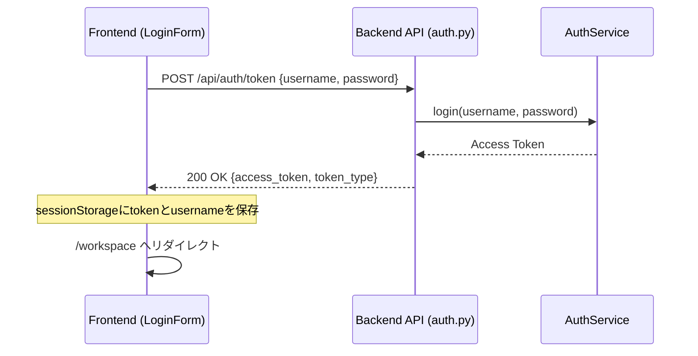
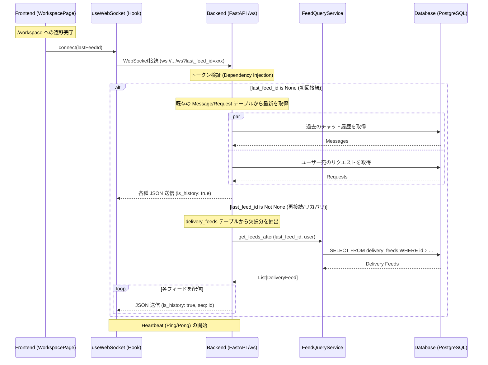
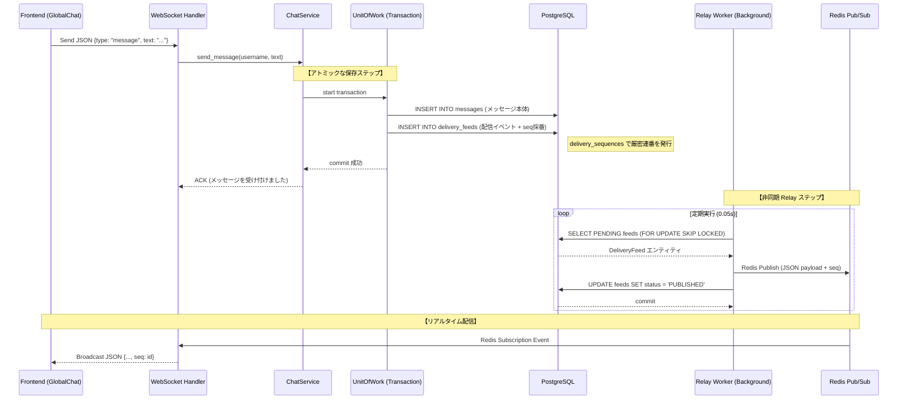
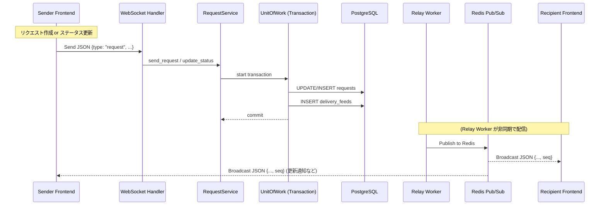
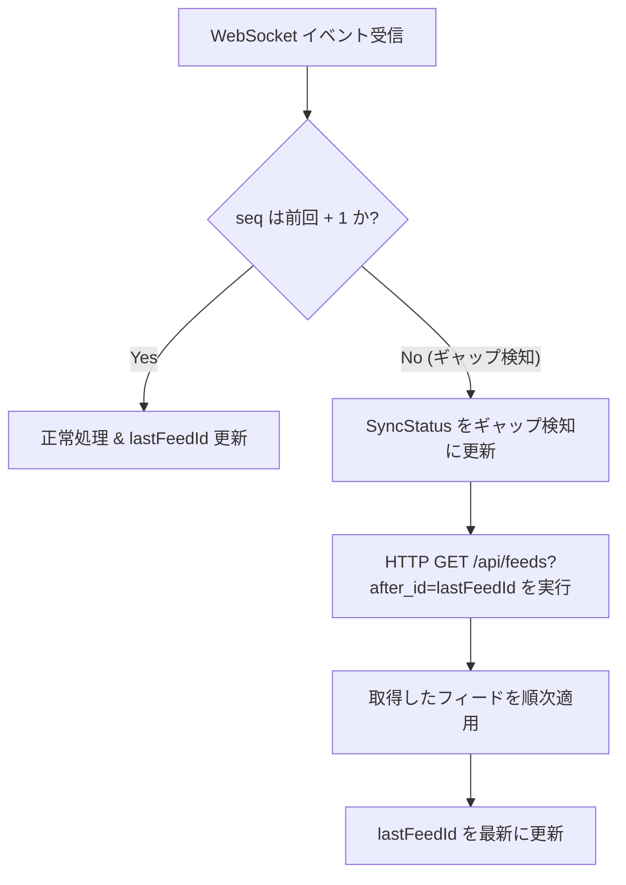

# システム処理フロー解説

本プロジェクトにおける主要な3つの処理（ログイン、チャット、リクエスト）のフロントエンドからバックエンドまでの流れを解説します。

## 1. ログイン処理 (Login Flow)

ユーザー認証を行い、WebSocket接続に必要なアクセストークンを取得するフローです。

### 詳細ステップ
1.  **Frontend**: ユーザーがアカウントを選択または入力し、ログインボタンをクリックします。
2.  **API呼出**: `LoginForm` から `/api/auth/token` へ認証情報を送信します。
3.  **Backend**: `AuthService` がユーザー情報を検証し、セッション用のトークンを発行します。
4.  **保存**: フロントエンドは取得したトークンを `sessionStorage` に保存し、ワークスペース画面へ遷移します。

---

## 2. WebSocket 確立・初期同期フロー (WS Establishment)

ログイン後、ワークスペース画面でリアルタイム通信が開始されるまでのフローです。Outboxパターンの導入により、再接続時には `last_feed_id` を用いた確実な欠損補完が行われます。

### 詳細ステップ
1.  **接続開始**: `WorkspacePage` がマウントされると、`sessionStorage` のトークンと（もし保持していれば） `lastFeedId` を用いて WebSocket 接続を初期化します。
2.  **認証**: FastAPI の `get_ws_authenticated_user` がトークンを検証します。
3.  **同期/リカバリ**: 
    *   `last_feed_id` がない場合は、メッセージとリクエストの各テーブルから直近のデータを取得して送信します。
    *   `last_feed_id` がある場合は、`FeedQueryService` を介して `delivery_feeds` テーブルからその ID 以降の全てのイベントを、発生した順番通りに取得して再送します。これによりメッセージの抜け漏れが防止されます。
4.  **維持**: 接続維持のため、定期的な Heartbeat が開始されます。

---

## 3. チャット処理 (Transactional Outbox Flow)

Transactional Outbox パターンにより、DB保存とイベント配信の原子性（Atomicity）と順序性を保証するフローです。

### 詳細ステップ
1.  **アトミック保存**: `ChatService` はメッセージの保存と同時に、`delivery_feeds` テーブルに配信用のイベントデータを同一トランザクション内で書き込みます。この際、`delivery_sequences` テーブルを介して「欠番のない厳密な連番 (seq)」が割り振られます。
2.  **DBコミット**: トランザクションが成功した時点で、メッセージの永続化と「配信待ち状態」の確定が同時に完了します。
3.  **Relay Worker**: 別プロセスの `RelayWorker` が `PENDING` 状態のフィードを監視します。`SKIP LOCKED` により、複数台のサーバーがいても重複なく安全に処理されます。
4.  **配信**: ワーカーが Redis にパブリッシュすることで、全インスタンスの WebSocket ハンドラへイベントが届き、クライアントへ配信されます。最後にステータスを `PUBLISHED` に更新して完了します。

---

## 4. リクエスト処理 (Request Outbox Flow)

リクエスト送信やステータス更新も、チャットと同様に Outbox パターンで処理されます。

### 詳細ステップ
1.  **整合性保証**: リクエストの新規作成やステータス変更（承認/却下）は、常に `delivery_feeds` へのイベント書き込みとセットで DB にコミットされます。
2.  **順序性**: 全てのイベントに `seq` が付与されるため、クライアント側で「リクエスト作成イベント」の後に「承認イベント」が確実に届く（あるいはその順序でリカバリできる）ことが保証されます。
3.  **一貫性**: DBへの書き込みが成功したなら、必ず（Relay Worker によって）いつかは配信されることが保証されます（At-least-once）。

---

## 5. ギャップ検知とリカバリ (Gap Detection & Recovery)

ネットワーク不安定等でメッセージが一時的に欠落した場合の自己修復フローです。

### 詳細ステップ
1.  **検知**: クライアントは受信したメッセージの `seq` 番号をチェックします。もし前回受信した番号より 2 以上大きい場合は、その間にメッセージの取りこぼしがあったと判断します。
2.  **リカバリ**: ギャップを検知すると、フロントエンドは自動的に `/api/feeds` 統合エンドポイントを叩き、不足している ID 範囲のデータを取得します。
3.  **統合同期**: WebSocket でリアルタイムに届く最新イベントと、HTTP でリカバリした過去イベントは、`id` に基づくマージ処理（`mergeById`）によって重複なく正しく UI に反映されます。

---

### 技術的な特徴
-   **Transactional Outbox パターン**: DB更新とイベント発行の不整合を排除し、信頼性の高い非同期配信を実現しています。
-   **厳密連番 (Strict Sequencing)**: `delivery_sequences` テーブルにより、分散環境でも欠落のない連番を保証し、クライアント側でのギャップ検知を可能にしています。
-   **統合リカバリ API**: チャットとリクエストの更新を1つの「フィード」として統合管理し、単一のエンドポイントで一貫したリカバリを可能にしています。
-   **Relay Worker (SKIP LOCKED)**: DBのキューイングにおいて、行ロックをスキップする高度なクエリを用いることで、競合なく効率的なバックグラウンド配信を行っています。
-   **Onion Architecture & UoW**: ビジネスロジックの純粋性と、トランザクションの境界管理を明確に分離しています。
